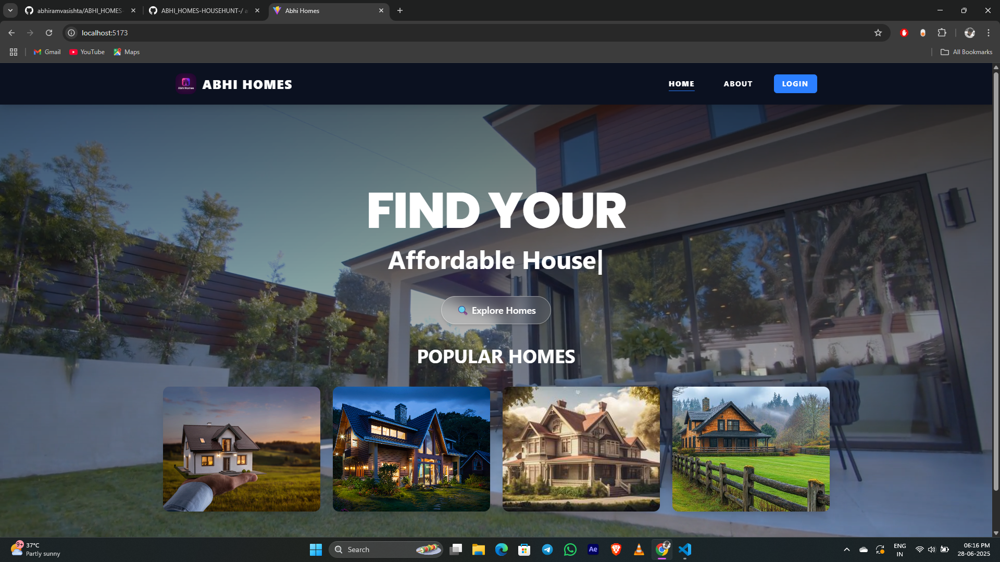
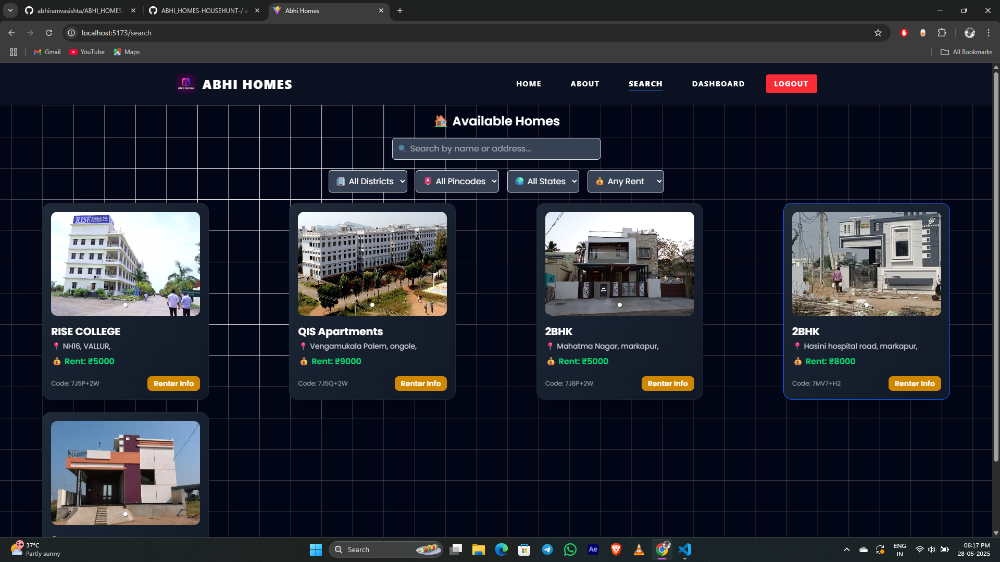
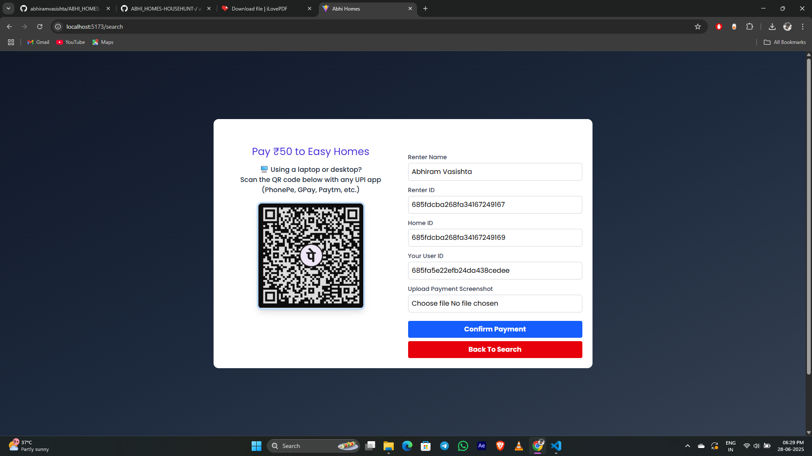
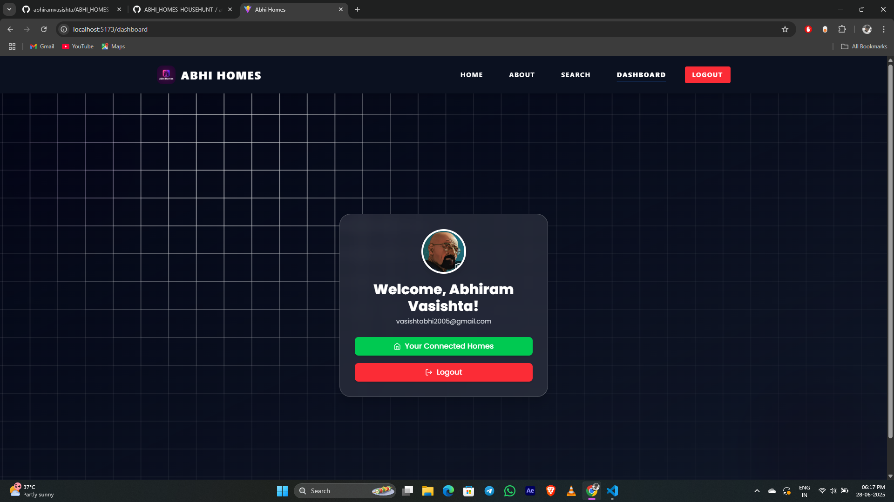

# AbhiHomes 🏡

**AbhiHomes** is a modern, full-stack, fully responsive real estate web application that allows users to search and explore homes with ease. The platform features a sleek UI with animated transitions, Google OAuth login, and rich visual content to enhance the user experience.

---

## 🔥 Features

- 🎥 **Video Background Hero Section** with typewriter animation
- 🖼️ **Home Listings Gallery** with elegant card layouts
- 🔐 **Google OAuth** for seamless authentication
- ⚡ Built with **React 18**, **Vite**, and **Tailwind CSS**
- 🎨 Smooth animations using **Framer Motion**
- 📱 Fully responsive and mobile-friendly design

---

## 🚀 Technologies Used

- **Frontend**: React, Vite, Tailwind CSS, Framer Motion
- **Backend**: Node.js, Express, MongoDB, Mongoose, JWT
- **Auth**: Google OAuth via `@react-oauth/google`
- **API Communication**: Axios
- **Icons**: Lucide React

---

---

## 📸 Project Screenshots

### 🏠 Home Page


### 🔍 Search Page


### 📝 Renter Form Page


### 📊 Payment Page


### 📊 Dashboard Page



---

## 📁 Project Structure

```
abhihomes/
├── frontend/
│   ├── public/
│   ├── src/
│   ├── project-images/      # Screenshots for README
│   ├── App.jsx, main.jsx
│   └── package.json, .env
│
├── backend/
│   ├── controllers/
│   ├── models/
│   ├── routes/
│   ├── seedData.js
│   ├── server.js
│   └── package.json, .env
```

---

## ⚙️ Getting Started

### Prerequisites

- Node.js v18+
- MongoDB (local or cloud)
- npm or yarn

---

## 🔧 Installation

### 1. Clone the repository

```bash
git clone https://github.com/yourusername/abhihomes.git
cd abhihomes
```

### 2. Setup Backend

```bash
cd backend
npm install
```

Create a `.env` file in the `backend` directory:

```env
PORT=5000
MONGO_URI=your_mongodb_connection_string
JWT_SECRET=your_jwt_secret
GOOGLE_CLIENT_ID=your_google_client_id
```

Seed initial data (optional):

```bash
node seedHomes.js
```

Start backend server:

```bash
npm run dev
```

---

### 3. Setup Frontend

```bash
cd ../frontend
npm install
```

Create a `.env` file in the `frontend` directory:

```env
VITE_API_URL=http://localhost:5000
VITE_GOOGLE_CLIENT_ID=your-google-client-id
```

Start frontend dev server:

```bash
npm run dev
```

To build for production:

```bash
npm run build
```


## 👨‍💻 Author

Made with ❤️ by **Abhiram**
